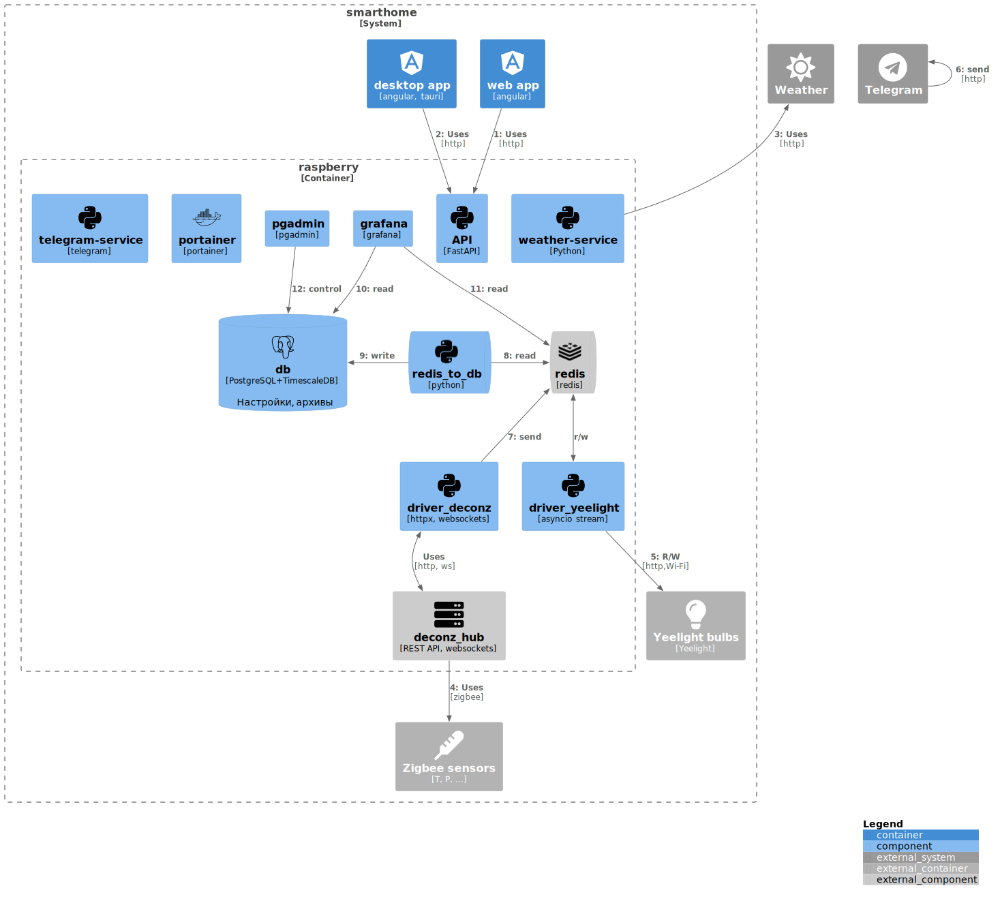

Управление автоматикой в доме.

Структурная схема:

Документацию можно смотреть в [obsidian](https://obsidian.md/). Открыть корневую папку репозитория (open folder as vault). Затем можно открывать по ярлыку `obsidian.py`.

## Установка

### Установка ОС

Операционная система - Raspbian. Образ удобно записывать raspberry imager. При создании образа активировать доступ по SSH, задать пользователя.

После установки командой sudo raspi-config открыть доступ по VNC. Подключиться можно через VNC-клиент [realvnc](https://www.realvnc.com/en/connect/download/viewer/).

### Установка ПО

Установка - [setup/README](setup/README.md)

Сервисы:

- sh_db - [db/README](db/README.md)
- portainer - https://

### Документация

Ссылки:
- исходный код python - [sphinx](docs/sphinx/out/index.html)

Подробнее о генерации - [docs/README](docs/README.md)